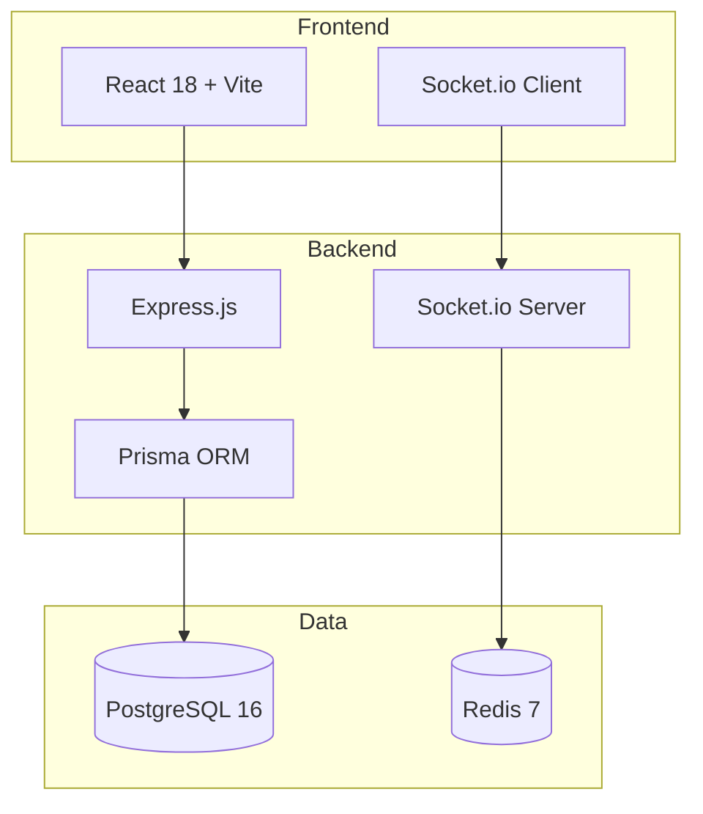

<div align="center">

# 🛵 PedidoRapido

[](https://nodejs.org)
[](https://reactjs.org)
[](https://postgresql.org)
[](https://socket.io)
[](https://docker.com)
[](LICENSE)

**Plataforma completa de pedidos delivery com rastreamento em tempo real**

</div>

---

## 📖 Sobre

PedidoRapido e uma plataforma de delivery que conecta clientes, restaurantes e entregadores. Faca pedidos, acompanhe em tempo real via WebSocket e gerencie entregas.

## 🏗️ Arquitetura



## 📡 WebSocket Events

| Evento | Direcao | Descricao |
|--------|---------|-----------|
| `order:new` | Server -> Client | Novo pedido recebido |
| `order:status` | Server -> Client | Status do pedido atualizado |
| `driver:location` | Server -> Client | Localizacao do entregador |

## 📡 API Endpoints

| Metodo | Rota | Descricao | Auth |
|--------|------|-----------|------|
| POST | `/api/auth/register` | Criar conta (com role) | - |
| POST | `/api/auth/login` | Login | - |
| GET | `/api/auth/me` | Perfil | ✅ |
| GET | `/api/restaurants` | Listar restaurantes | - |
| GET | `/api/restaurants/:id` | Detalhes + cardapio | - |
| POST | `/api/restaurants/:id/menu` | Criar item do cardapio | ✅ RESTAURANT |
| POST | `/api/orders` | Criar pedido | ✅ |
| GET | `/api/orders` | Listar pedidos | ✅ |
| PUT | `/api/orders/:id/status` | Atualizar status | ✅ |
| GET | `/api/orders/:id/track` | Rastrear pedido | ✅ |
| GET | `/api/driver/available` | Entregas disponiveis | ✅ DRIVER |
| POST | `/api/driver/accept/:id` | Aceitar entrega | ✅ DRIVER |
| PUT | `/api/driver/complete/:id` | Concluir entrega | ✅ DRIVER |

## 🚀 Rodando com Docker

```bash
docker compose up -d
```

- Frontend: http://localhost:3000
- Backend API: http://localhost:4000

## 📄 Licenca

[CC BY-NC 4.0](LICENSE) — Rone Bragaglia — Uso comercial proibido sem autorizacao
